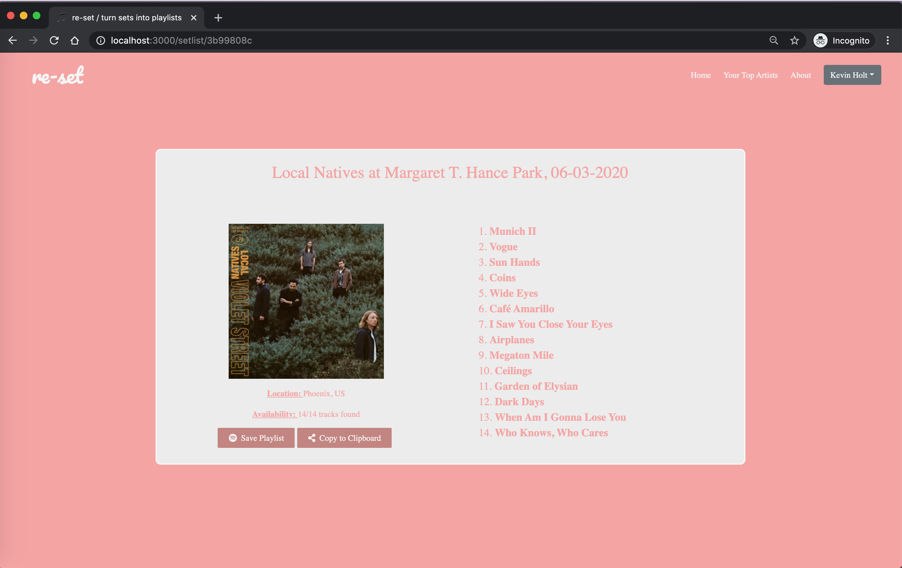

# re-set

re-set is a web application that allows users to search for past concert setlists from their favourite artists and convert them into Spotify playlists via the setlist.fm and Spotify APIs. This allows you to to live the concert experience on Spotify to either re-live a past experience or prepare for an upcoming one. Simply search for an artist of your choice or choose from a list of your top artist's from Spotify.

re-set is built using React, NodeJS, create-react-app, HTML, CSS, Spotify API and setlist.fm API.

# View the app on Heroku
https://re-set.herokuapp.com/

# Local Setup
- `clone` the repo
- `npm install` in root and client directories
- `npm run dev`

Concurrently is used to run both client and server code in the `npm run dev` command.

You'll need unique API keys from Spotify (https://developer.spotify.com/documentation/web-api/) and setlist.fm (https://api.setlist.fm/docs/1.0/index.html) to run the application. These should be set via environment variables.

# Screenshots

The below is the login screen that is conditionally rendered for users that are not logged in. This re-directs users to Spotify's authorization page, which provides re-set permission to access the user's Spotify to read basic user info, the user's top artists and create new playlists.

After logging in, the user is directed to the homepage with a searchbar to search for an artist.

After searching for an artist via Spotify, the search results are displayed.

Once an artist is selected, the setlist.fm setlists for the artist are displayed by date in descending order. Empty setlists are faded out and are not clickable. This page also features infinite scrolling, where additional setlist results are requested and rendered as the user scrolls to the bottom of the window.

The below shows the individual setlist component that displays all of the details for the setlist, including an album cover, list of tracks and an option to save the tracklist as a Spotify playlist. Each setlist has a dynamic route generated using react-router and the URL can be copied to share the link. Any tracks that are not found on Spotify (for example, artist may have played an unreleased song or a cover) are displayed in grey and will not be added to the playlist.

Once a user clicks the "Save Playlist" button, the playlist is created on the user's Spotify with all of the available tracks.

